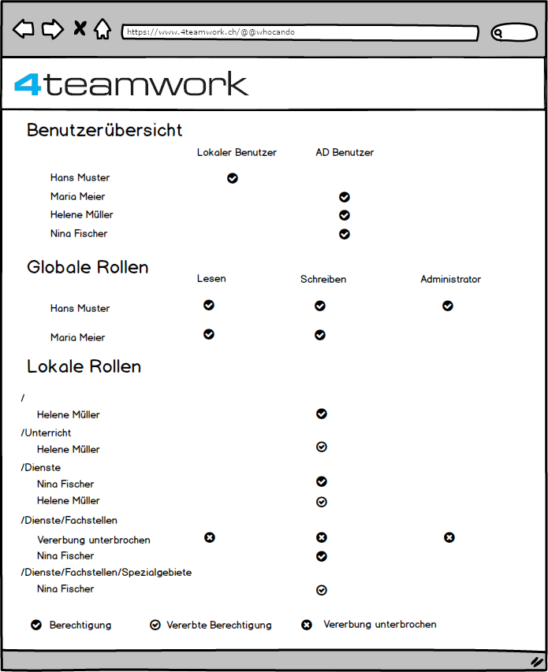

ftw.whocando
------------

.. contents:: Table of Contents

Introduction
============

ftw.whocando allows to list permissions for each user and page in a plone site installation.

Compatibility
-------------

Plone 4.3.x

Installation
============

- Add the package to your buildout configuration:

::

    [instance]
    eggs +=
        ...
        ftw.whocando

Development
===========

1. Fork this repo
2. Clone your fork
3. Shell: ``ln -s development.cfg buildout.cfg``
4. Shell: ``python bootstrap.py``
5. Shell: ``bin/buildout``

Run ``bin/test`` to test your changes.

Or start an instance by running ``bin/instance fg``.

Links
=====

- Github: https://github.com/4teamwork/ftw.whocando
- Issues: https://github.com/4teamwork/ftw.whocando/issues
- Pypi: http://pypi.python.org/pypi/ftw.whocando

Copyright
=========

This package is copyright by `4teamwork <http://www.4teamwork.ch/>`_.

``ftw.whocando`` is licensed under GNU General Public License, version 2.
